F(i) = F(i - 1) + F(i - 2) 

Base Case:

F(0) = 0

F(1) = 1

F 

Time Complexity: 

2 ^ n （2^64就溢出了）

Space Complexity: 

每层O(1) \* n level = O(n)

* 黑色箭头往下压，红色箭头往上返
* recursive 用完就释放了，eg. f(n - 2) 左边计算完毕就忘了， 右边f(n - 2)还需要再算，

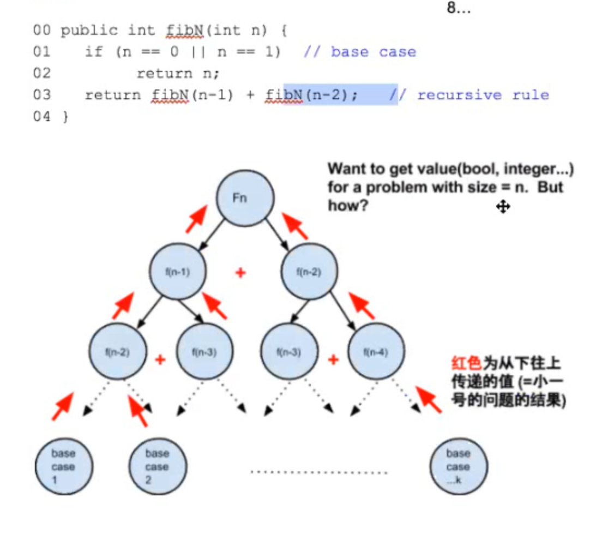

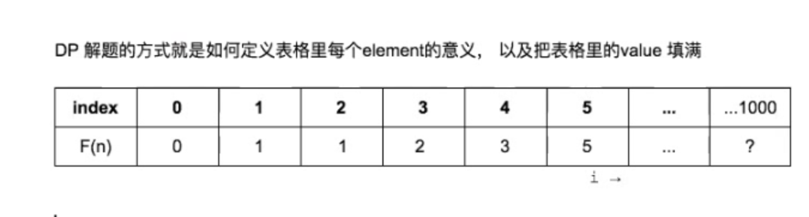

* DP—\> Proof by induction （从小到大解决问题，记录sub-solution）
* 从最小问题Base case 开始 k = 0, k = 1
  * 通过Linear Scan回头看小的sub-problems 来
  * Time Complexity: O(1) \* n = O(n)
  * 以空间换时间
  * Base case
  * Induction Rule
  * 
* Recursion（从大到小解决问题，不记录any sub-solution）
  * 到
  * 了Base case 触底反弹
  * Recursive rule
  * Time Complexity: O

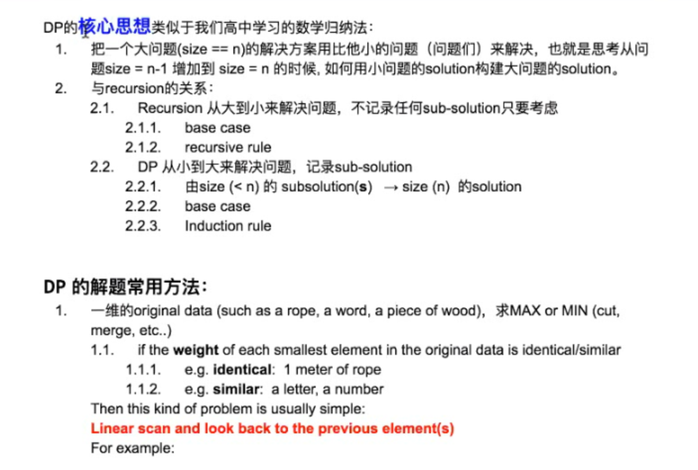

* 1.1 If the weight of each smallest element in the original data is identical / similar
* 1.2 similer but not identical (letters, 每个letter不能互相替代，不像等长的绳子都是identical，完全一样，可互相替代)
* 

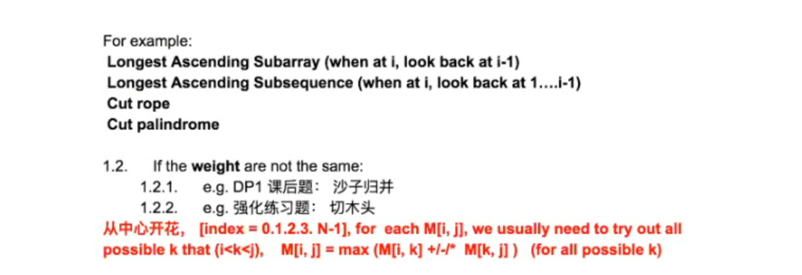

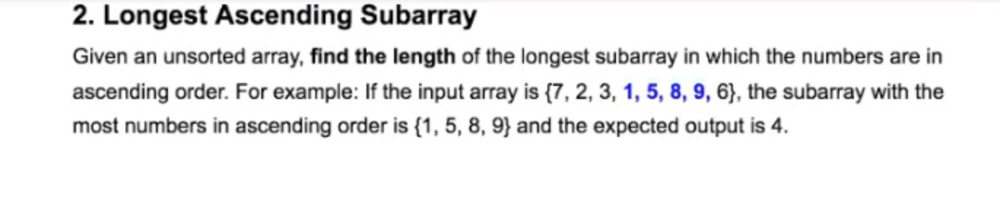

* Sub-array:
* Sub-sequence:

Discussion：

* **Base Case**: （最小号问题） 只有一个元素 {7} M[0] = 1, because there is only one element as the based case
* 如果利用Linear Scan来
  * input = {7, 12, }
  * M[i] 1 1
* **Induction Rule** : **M[i]** represents what??????
  * M[i] represent [from the 0-th element to the the i-th element], the value of the longest ascending subarray (including the i-th element), Since this value will be inherited by the next element 物理连续， 让后面一个有资格继承之前的一个
  * 从7 到 3， 包含3在内的最长的升续sub-array
  * keep a global max variable
* M[i] = M[i - 1] + 1; if input[i-1] \< input[i] else

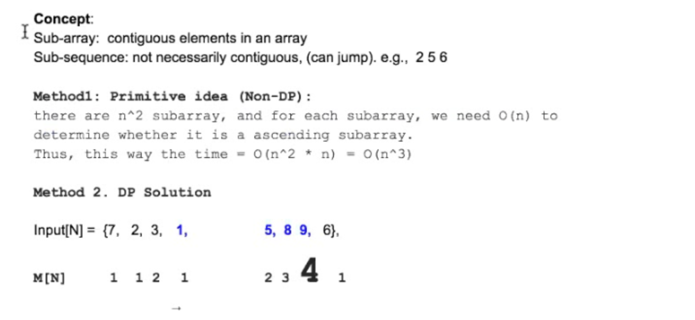

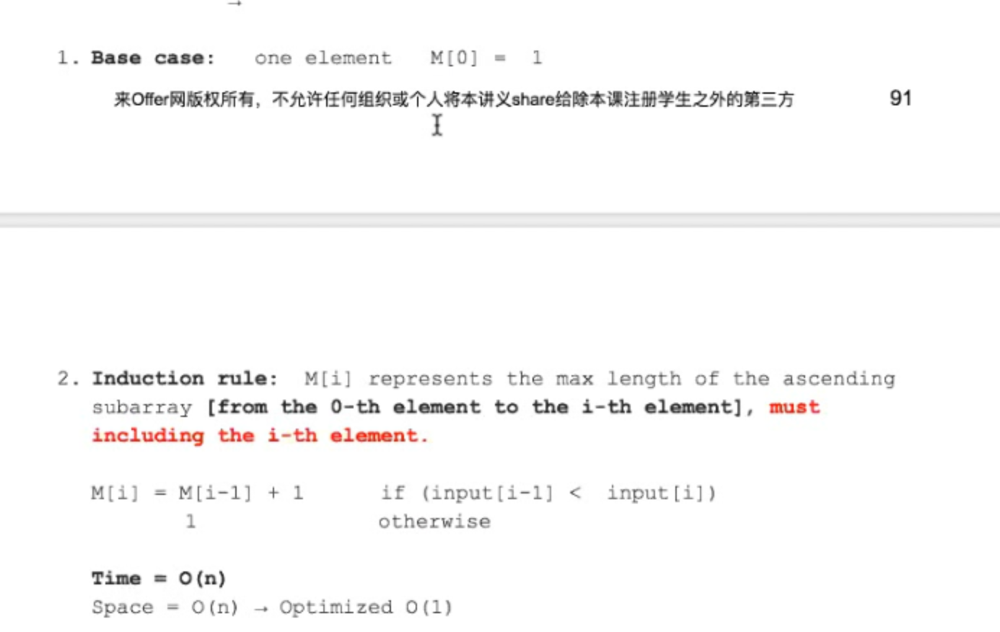

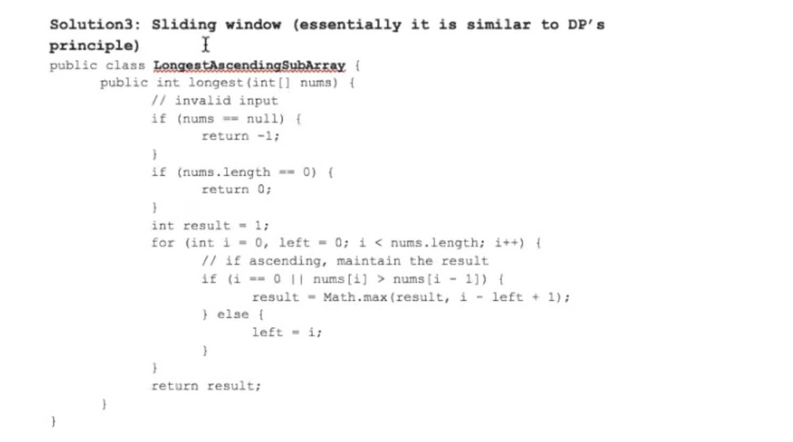

Q 3 Maximal Product when Cutting Rope
-------------------------------------

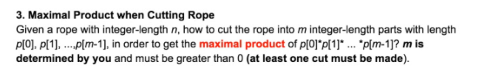

Solution (左大段 + 右大段): 
======================

**大段的意思是指，我们需要通过读表格，获取M[left] and M[right] 的数值**

1. Base Case: Smallest rope length = 1m 至少必须切一刀 M[1] = ?? 1 or 0 or to be decided // invalid input
2. Induction Rule:
  1. Input = 1m 2m 3m ….. 10m

 M[i] = represent maximal product of a rope with i - meter long )at least one cut must be made)

size = 1m

size = 3m 时不需要切2刀， 因为2m情况之前已经计算过了，M[2] 包含了切第二刀的情况（之前存过size = 2m的最优解!!!）

需要回头看所有previous cases(sizes) M[1], M[2], M[3], M[4], M[5],…

* So, The Time Complexity: O(N^2) ???
* The Space Complexity: O(n)

DP精髓：从小到大构建solution 每一步都是最优的

For this method, 

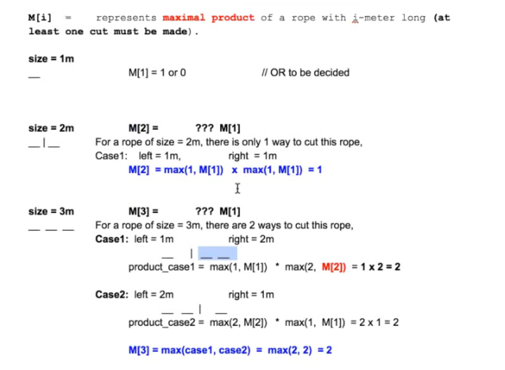

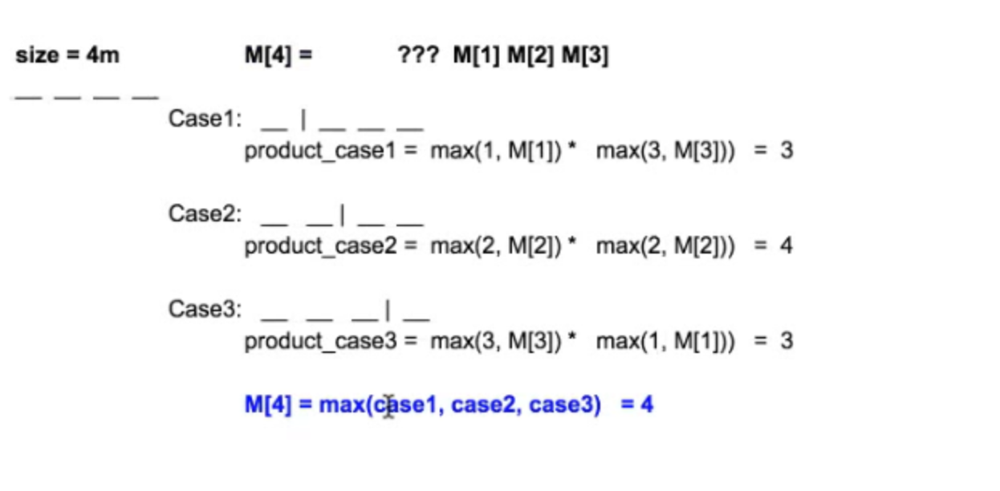

```java
// Time Complexity O(n^2)
// for loop 

public int cutRod(int n) {
  int[] M = new int[n + 1]; 
  M[0] = 0;
  M[1] = 0; // Base Case
  for (int i = 1; i <= n; i++) {   // n meters
    int curMax = 0;
    for (int j = 1; j <= i / 2; j++) {      // 左大段所有可能性 j meters, since it's symmetric 对称看一半
      curMax = Math.max(curMax, Math.max(j, M[j])) *  // 是不是有问题？max (curMax, Math.max()*Math.max)??
      Math.max(((i -j), M[i - j]));
    }
    M[i] = curMax;
  }
  return M[n];
}
```

It’s more preferable!!! 

对于非对称问题，not weighted的问题

 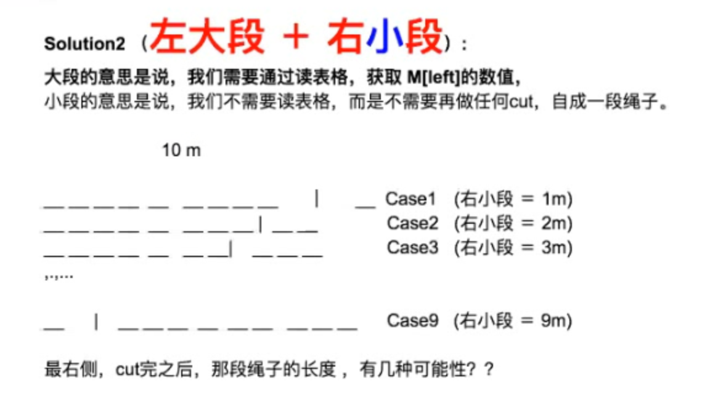

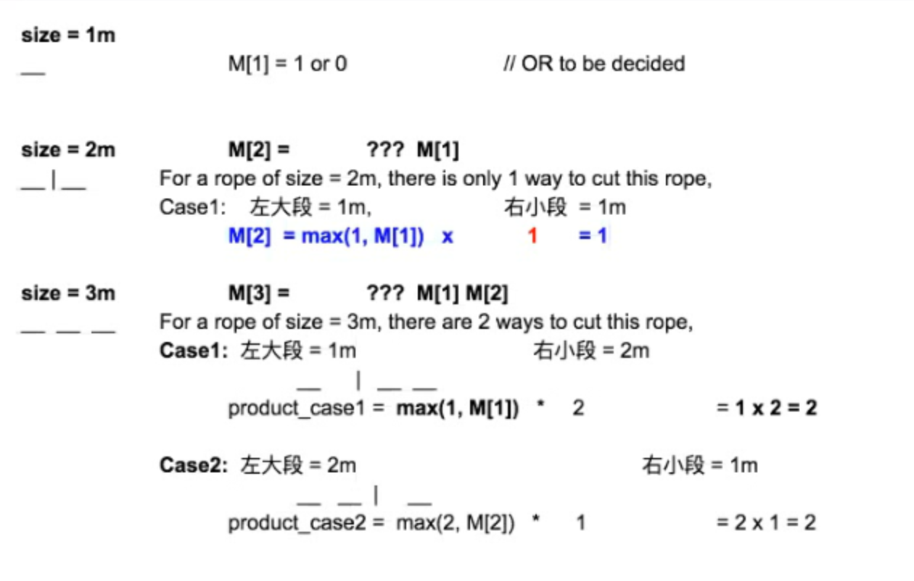

Solution 3: (Non-DP, can we do it with Recursion????)

 1\. Base Case

2\. Recursion Rule: 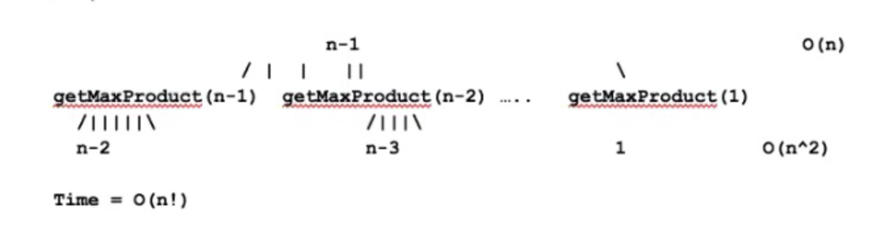

```java
// the for loop traverse all possible length of the right most rope
public int getMaxProduct(int n) {
  if (n <= 1) return 0; // base case
  int maxProduct = 0;
  for (int i = 1; i < n; i++) { // i = meters of rope as 右小段
    int best = Math.max(n - i, getMaxProduct(n - i)); // (no cut) rope remains, cut == subproblem
    maxProduct = Math.max(maxProduct, i * best)
  }
  return maxProduct;
}

```

Summary:

1\. 斐波那契数列是 只回头看i-1和i-2前两个

2\. Longest ascending subarray 回头看所有的

3\.

最小号问题是什么？

* 只有一个数 不用跳 [4]
* A = [ 2, 3, 1, 1, 4] , return true
* M[i] T T T T T
* Solution

1. Base case: M[n - 1] = true
2. Induction rule : M[i] represents what?????
  1. M[i] = whether or not we can jump to the target from the i-th index
  2. M[i] true iff there is an element j where j \<= i + input[i] (e.g. i = 0, input[0] = 2, **i + input[i] = 2 )**, and M[j] = true
  3. 

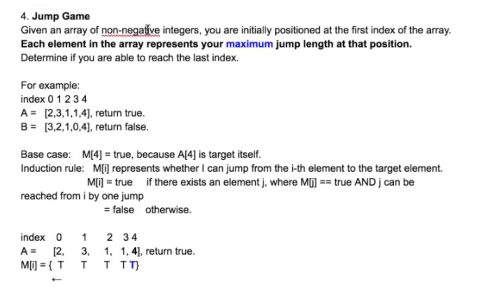

