Q 0 Minimum Number of Jumps 
============================

index 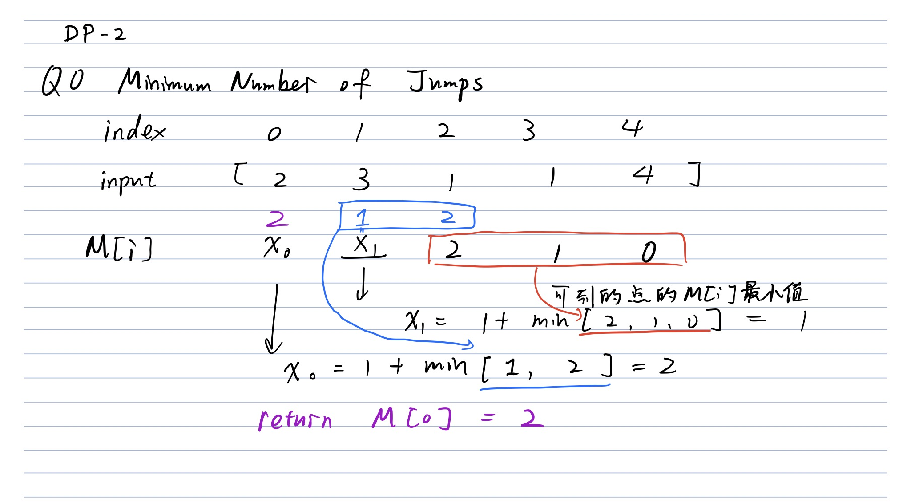

1. Base Case: M[n - 1] = 0
2. Induction rule
  1. M[i] represents the minimum number of jumps needed to jump from the i-th index to the target (n - 1)-th index (Needed \# of jumps to the end)
  2. M[i] = 1 + min( M[i + j] , where** j \<= input[i]** j can be reached from i by only one jump && i +j \< n 怎么和回头看的
3. Time Complexity:
  1. O(n ^ 2) or O(n \* k) where k is the largest number of jumps one can mke ???
4. Space Complexity:
  1. O(n)

Q1\. Largest Sum of Subarray (contiguous 物理连续)
==============================================

53\. Maximum Subarray

Given an unsorted array, find the subarray that has the greatest sum. Return the greatest sum. Return the sum.

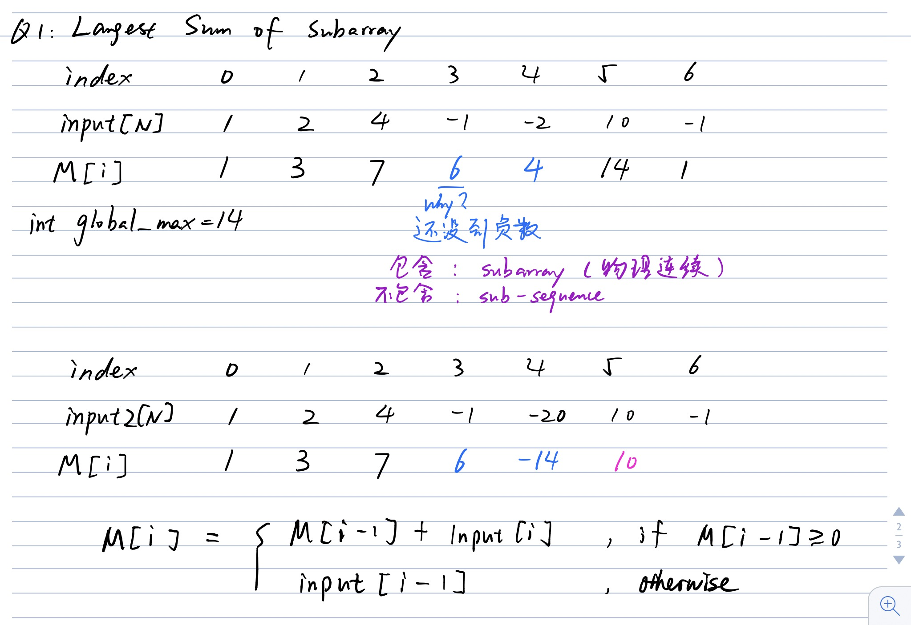

Solution:

1. Base Case: M[0] = input[0] // only
2. Induction rule: M[i] represents the largest sum of a subarray from the 0-th element to the i-th element, including the i-th element.
3. M [i] = M[i - 1] + input[i] if  M[i - 1] \>= 0;
4. Time Complexity: O(n)

 input[i] otherwise

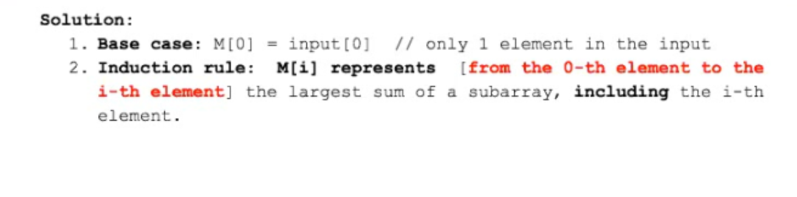

**Follow up 1: what if we want to optimize the space complexity to O(1) ?**

**Solution: That is easy, just replace M[i] array with a variable, named it as int previous\_value**

**
**

**Follow up 2: what if we want you to return the start and end indices of the solution array**

1. **We need only two variables, named start and end;**
  1. **Case 1: when to move start? **
    1. **we reset the start index when the previous element is negative **
  2. **Case 2: when to move end?**
    1. **end is always == i**
  3. **How to update the soul\_start, and soul\_end?**
    1. **when the global max is updated.**

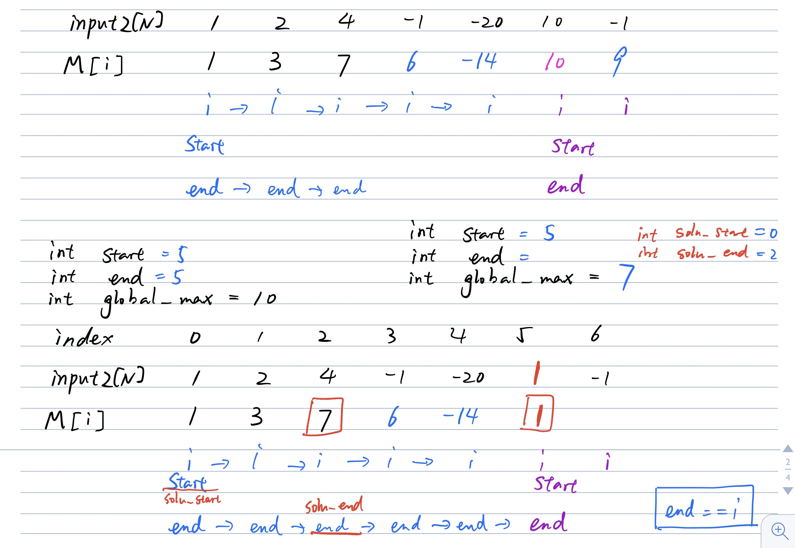

```java
public class Solution {
    public int maxSubArray(int[] nums) {
        int n = nums.length;
        int[] dp = new int[n];
        dp[0] = nums[0];
        int max = dp[0];
        
        for (int i = 1; i < n; i++) {
            if (dp[i - 1] > 0) {
                dp[i] = dp[i - 1] + nums[i];
            }
            else {
                dp[i] = nums[i];
            }
            max = Math.max(max, dp[i]);
        }
        return max;
    }
}

// 
public class Solution {
    public int maxSubArray(int[] nums) {
        int n = nums.length;
        int[] dp = new int[n];
        dp[0] = nums[0];
        int maxSum = dp[0];
        
        for (int i = 1; i < n; i++) {
            dp[i] = nums[i] + (dp[i - 1] > 0 ? dp[i - 1]: 0);
            maxSum = Math.max(maxSum, dp[i]);
        }
        return maxSum;
    }
}
```

Q2\. Dictionary Word Problem
============================

139\. Word Break

Given a word, can it be composed by concatenating word from a given dictionary? 

Example: 

bob cat rob 

word1: bobcatrob True

word2: bcoabt False

**Solution**:

1. Base Case: M[0] = False // string input[0] is in the dictionary or not
2. Induction rule: M[i] = OR

size == 0,] no letter, false

size == 1, 1 letter b, M[1] = false;

How can we tell whether b can be formed by the word in the dictionary?

Answer: Just manually check against the hashSet, which stores the dictionary? O(1)时间知道

size == 2, M[2] = 

2 letters bo 

How can we tell whether b can be formed by the word in the dictionary??

Answer: there is only 1 case, where we can make the cut to b o 

* Case0: No cut: bo, manually check whether ‘bo’ is in the dictionary
* Case 1: b && o
* 左大段 = b which can be read 右小段 = o
* from the table that is M[1] Manually check whether the word ‘o’ is in the dictionary or not
* 绳子都是一样的，但2 letters bo 和 右边的 bc 不一样

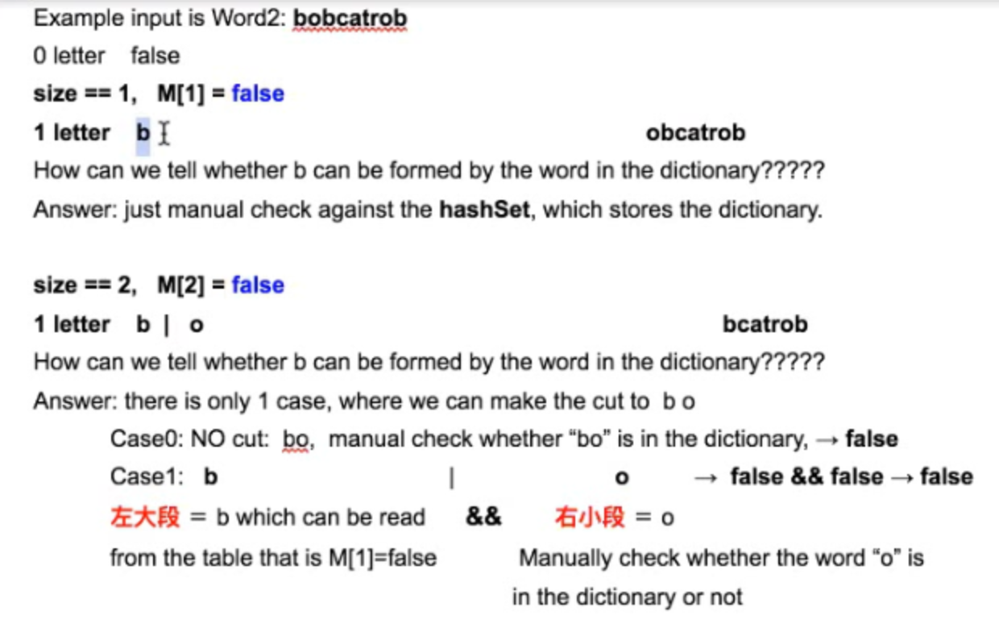

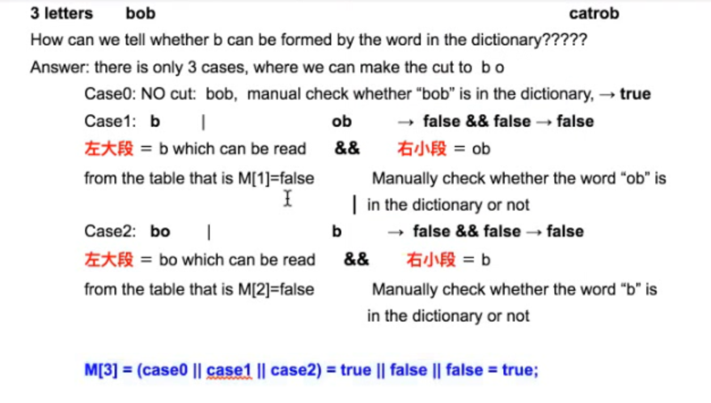

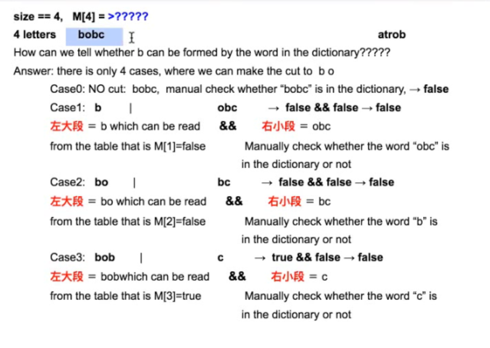

M[4] = (case0 || case1 || case2 || case3 ) = false || false || false || false = false;


```java
// 先看signitrue 
// for for 嵌套式循环
// Time Complexity = O(n ^ 3) ????
public boolean wordSolver(String word, HashSet<String> dict) {
  int n = word.length();            // b obc   atrob  n = 9
  boolean[] M = new boolean[n + 1] // include 0
  // case 0: grow the letter one by one, since subString(i, j) 不包括j, 所以包括n = word.length()
  for (int i = 1; i <= n; i++) {                // if the word is in the dictionary, done
    if (dict.contains(word.subString(0, i))) {
      M[i] = true;      // case 0
      continue;
    }
    // Otherwise, check the possible single splite
    for (int j = 0; j < i; j++) {
      // check subproblem(case 1, 2, 3) and check the rest of the word
      if (M[j] && dict.contains(word.subString(j, i))) {  // M[j]左大段，右边check右小段manually
         M[i] = true;
        break;
      }
    }
    
  }
  return M[n];
}
```

139\. Word Break

Given a non-empty string *s* and a dictionary *wordDict* containing a list of non-empty words, determine if *s* can be segmented into a space-separated sequence of one or more dictionary words. You may assume the dictionary does not contain duplicate words.

For example, given
*s* = `"leetcode"`,
*dict* = `["leet", "code"]`.

Return true because `"leetcode"` can be segmented as `"leet code"`.

UPDATE (2017/1/4):
The *wordDict* parameter had been changed to a list of strings (instead of a set of strings). Please reload the code definition to get the latest changes.

```java
// Time complexity: O(n^3)
// n(for i) * n(for(j)) * n(substring)
public class Solution {
    public boolean wordBreak(String s, List<String> wordDict) {
        if (s == null || s.length() == 0) return true;
        
        int n = s.length();
        boolean[] dp = new boolean[n + 1];  // add ['', 'leet', 'code']  n + 1
        dp[0] = true;                       // '' is true
        Set<String> dictSet = new HashSet<String>();
        // bobc|atrob  n = 9, i = 1, 2, 3,..., 10  
        
        // transfer List<String> to HashSet, search word with O(1) time complexity
        for (String w : wordDict) {
            dictSet.add(w);
        }

        for (int i = 1; i <= n; i++) {
            if (dictSet.contains(s.substring(0, i))) {
                dp[i] = true; 
                continue;
            }  
            
            for (int j = 0; j < i; j++) {
                // check subproblems dp[j] 左大段， dictSet.contains(s.substring(j, i)) 右小段
                if (dp[j] && dictSet.contains(s.substring(j, i))) {  // string.substring O(1)
                    dp[i] = true;
                    break;
                }
            }
        }
        return dp[n];
        
    }
}
```

Q3\. Edit Distance （2D\_DP）重思维分析
================================

Given two strings of alphanumric characters, determine the minimum number of Replace, Delete, and Insert operations needed to transform one string into the other.

 Example:

]

S2 = ‘sghj’

Example:

s1 = a | sdf

s2 = s | ghj

(1) Replace: a -\> s

s sdf

s ghj

editDistance(sdf, ghj) + 1

(2) Delete

 sdf

sghj

editDistance(sdf, sghj) + 1

(insert) 

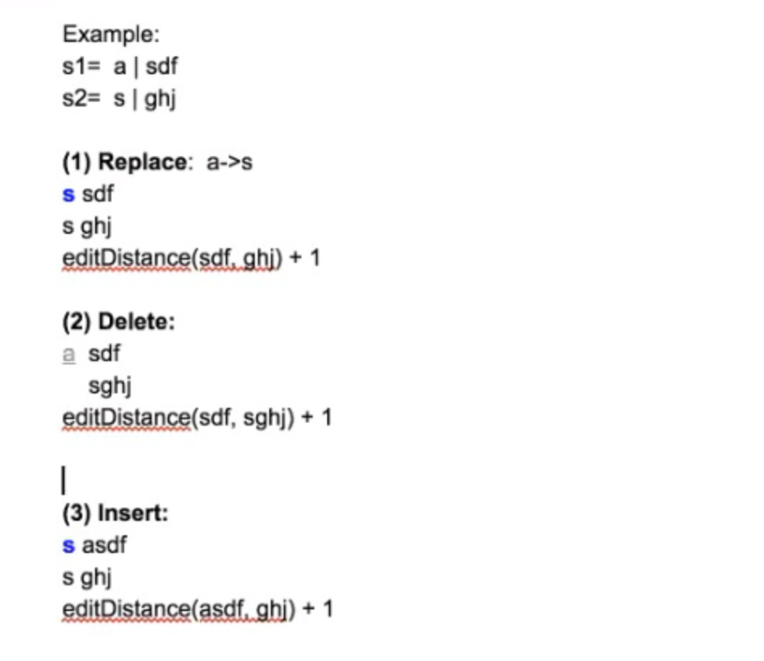

* Time Complexity:
* How many levels? W1.length = n, W2.length = n, there are 2n levels in the recursion tree. Time = O(4 ^ 2n
* )

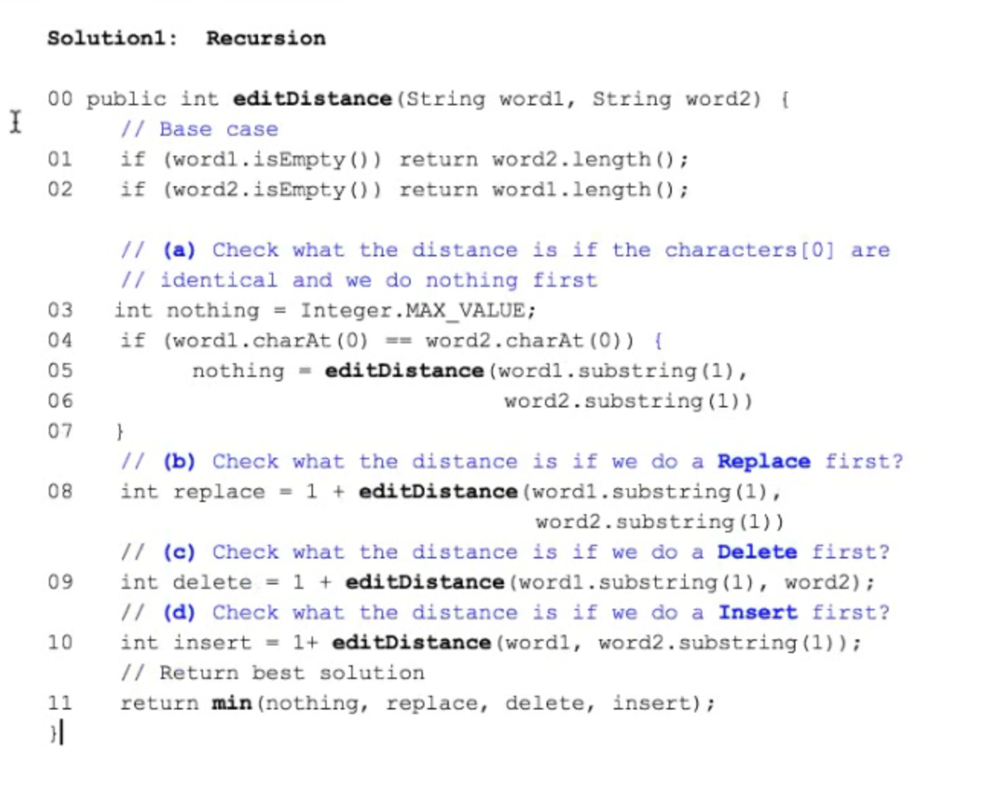

Method 2: DP

s1 = xxxx….xx + “a” size = i

s2 = yyy….yy + “s” size = j 

c1 is the last letter of the string s1

c2 is the last letter of the string s2

**dp[i][j]** represents the minimum number of actions to transform substring (the first i letter of s1 to the )

Base case 只有一个letter

s1 = “a” —\> s

s2 = “s”

**Case 1**: Do nothing 不满足 since s1[0] != s2[0]

**Case 2**: **Replace** c1 with c2 distances (s1r + c1, s2r + c2) = **1 + distance(s1r, s2r)** // s1 remaining

 **editDistance(1, 1) —\> 1 + editDistance(0, 0)**

generalized to 

**editDistance(i, j) —\>** **1 + editDistance(i - 1, j - 1) **

**Case3: Delete** c1: distance(s1r + c1, s2r + c2) = **1 + distance(s1r, s2) // 删了s1里的一个元素**

**editDistance(1, 1) —\> 1 + editDistance(0, 1)**

**
**

**generalized to **

**editDistance(i, j) —\>** **1 + editDistance(i - 1, j )  // ****删了s1里的一个元素，so i - 1**

**Case 4: Insert** a new char(c2) to the right side of c1:

distance(s1 + c1, s2r + c2) = **1 + distance(s1, s2r) **

**editDistance(1, 1) —\> 1 + editDistance(1, 0)**

**
**

**generalized to **

**editDistance(i, j) —\>** **1 + editDistance(i , j - 1) **

**
**

**
**

**s1.length = i complete size of s1 = n letters**

**s2.length = j complete size of s2 = m letters**

**how many possible pairs of \<i, j\> = m \* n !!!!**

**
**

**s1: first i letter — \> how to convert t**

**s2: first j letter **

dp[i][j] == ??

Case 0: dp[i - 1][j - 1] **if **s1[i - 1] = s2[j - 1]

else 

min (Case 1: 1 + dp[i - 1] [j - 1] // replace

 Case 2: 1 + dp[i - 1][j] // delete

 Case 3: 1 + dp[i][j - 1] ) // insert

**How to fill in the 2D dp[i][j] matrix?**

since a != s, so not satisfied the case0, 谁小取谁+ 1 所有 dp[1, 1] = 1

since s == s (dp[2][1] = dp[1][0] = 1) 

Space complexity: O(m \* n)—\> O(2 \* n) since we just need 2 rows value to compute the current value, we don’t need to save all the previous values （只需两行的值）

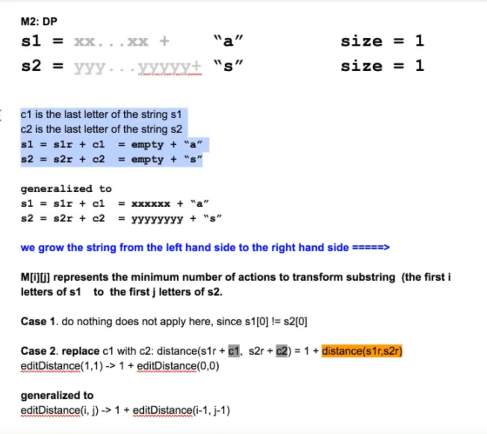

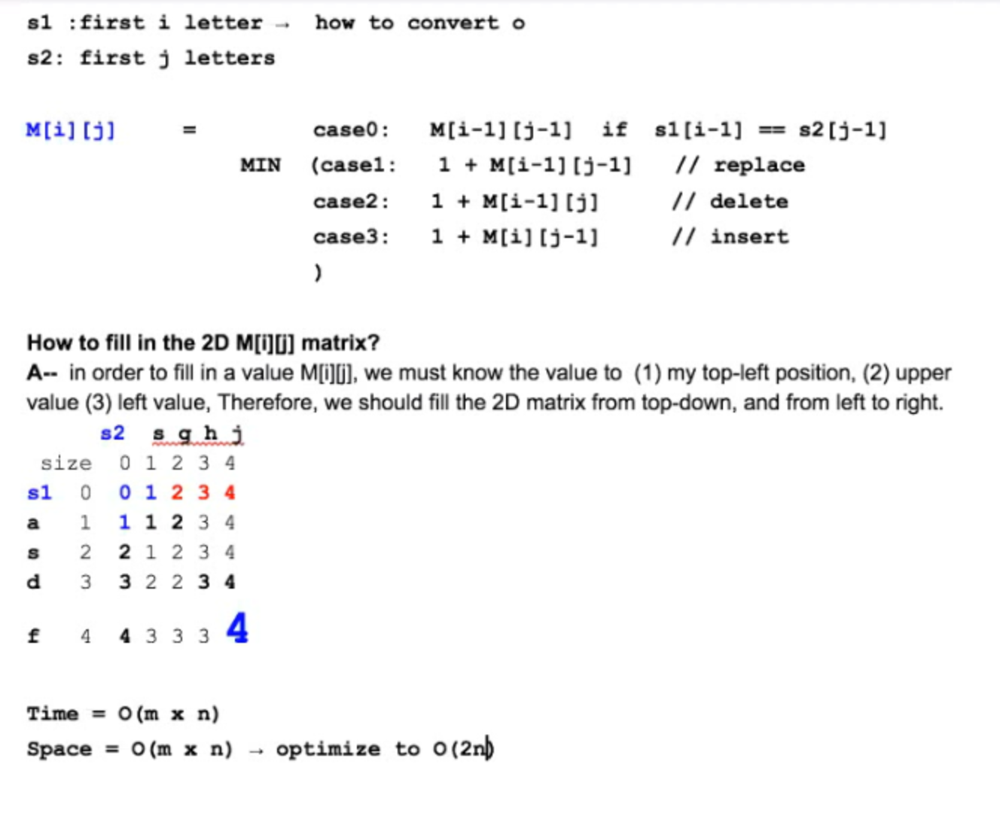

//

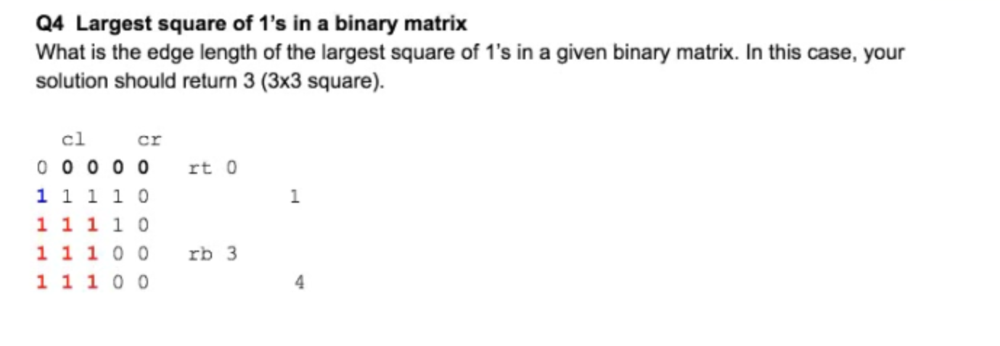

N \* N —\> 有多少sub-square？

Cn2个点可以作为左上角，n^2个左上角，每个点可以n个自由度，所以是O(n^2 \* n) = O(n ^ 3)

Subproblem: dp[i][j] represents the max size of square with the coordinate[i][j]

左上方实心正方形的size，左边点dp实心正方形的

