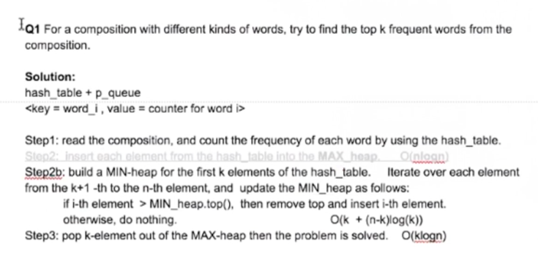

\<Li, 2\>, =\> \<key, value\> pair，查key通过O(1) 的时间找到

\<Zhang, 1\>

**Hash\_Table (general term):**

* Hash Set is a set {1, 3}, it only contains keys, 只查key 有没有这个element
  * e.g. find a line that can cross the most number of points in 2D spaces.
  * y = ax + b
* has\_map is a \<key, value\> pair

**Hash Table **

1. hash\_map
2. principle \<key = string/ int/ obj…, value = obj, string, int, …\>
  1. e.g. \<Sring, int\>
    1. \<tim, counter++= 2\>
    2. \<john, counter++= 1\>
3. syntax: declare - \> int m; hash\_map\<string, int\> map1:
4. hash collision
  1. chaining
  2. open address( probe + rehash)
  3. wiki

**经典例题Q1: For a composition with different kinds of words, try to find the top k frequent words from the composition. **

(PocketGem 一面原题)

OOD: [mapreduce]

**Step 1:** Read the composition, and use a **hash\_table  **\<key = string, value = int\> to count the frequency of each word

O(n) 

**Step 2a:** keep a MIN-heap of **size k** (each element in the heap can be represented as \<key, value\>), for each entry \<key\_x, value\_y\> in the hash\_table, you compare the top value with value\_x, 

* Case 1: if Min-Heap.top + value \> value\_x do nothing(continue)
* Case 2: else MIN-heap.pop() and then Min-heap.insert(\<key\_x, value\_x\>)
* Time Complexity = **O(n + n\*log(k)) **
* **O(klogk + (n-k)\*logk + )**
* dd

Step 2b: build a MIN-heap for the first k elements of the hash\_table. 

 