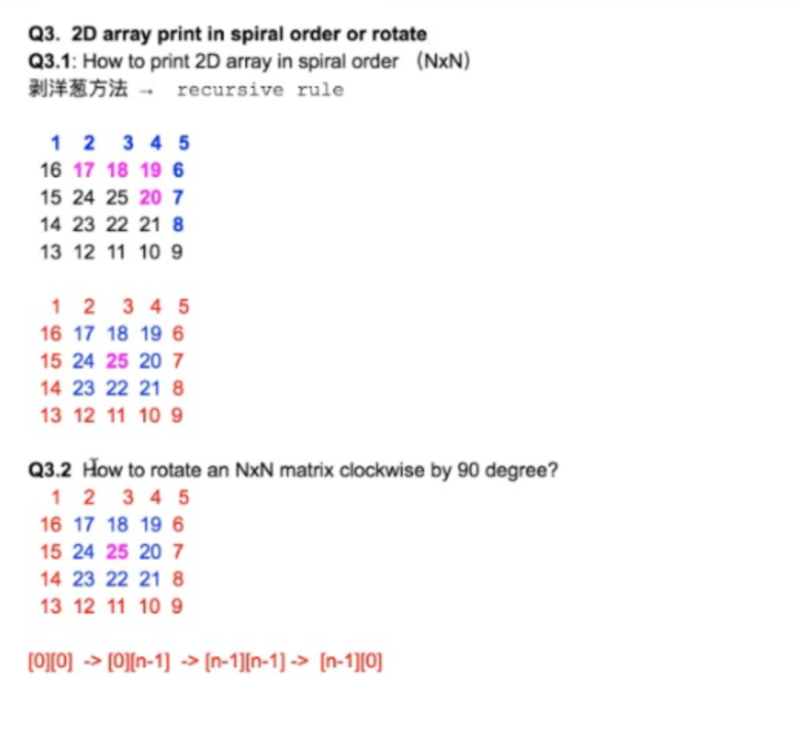
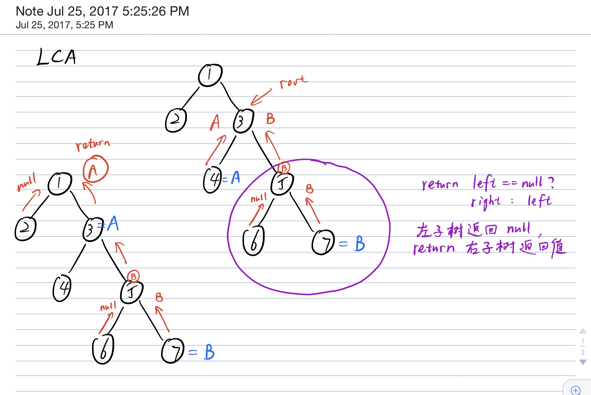
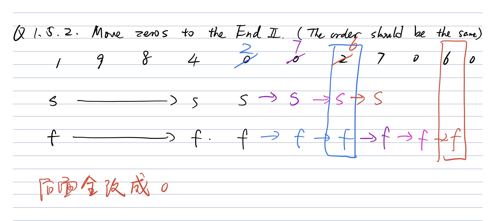

Get Keys In Binary Tree Layer By Layer Zig-Zag Order:

Get the list of keys in a given binary tree layer by layer in zig-zag order.

Examples

 5

 / \\

 3 8

 / \\ \\

 1 4 11

the result is [5, 3, 8, 11, 4, 1]

Corner Cases

* What if the binary tree is null? Return an empty list in this case.

How is the binary tree represented?

We use the level order traversal sequence with a special symbol "\#" denoting the null node.

For Example:

The sequence [1, 2, 3, \#, \#, 4] represents the following binary tree:

 1

 / \\

 2 3

 /

 4

```java
/**
 * public class TreeNode {
 *   public int key;
 *   public TreeNode left;
 *   public TreeNode right;
 *   public TreeNode(int key) {
 *     this.key = key;
 *   }
 * }
 */
public class Solution {
  public List<Integer> zigZag(TreeNode root) {
    List<Integer> result = new ArrayList<>();
    if (root == null) {
      return result;
    }
    boolean left = false;
    Deque<TreeNode> deque = new LinkedList<>();
    deque.offerFirst(root);
    while (!deque.isEmpty()) {
      int size = deque.size();
      for (int i = 0; i < size; i++) {
        if (!left) {
          TreeNode cur = deque.pollLast();
          result.add(cur.key);
          if (cur.right != null) {
            deque.offerFirst(cur.right);
          }
          if (cur.left != null) {
            deque.offerFirst(cur.left);
          }
        } else {
          TreeNode cur = deque.pollFirst();
          result.add(cur.key);
          if (cur.left != null) {
            deque.offerLast(cur.left);
          }
          if (cur.right != null) {
            deque.offerLast(cur.right);
          }
        }
      }
      left = left == true ? false : true;
    }
    return result;
  }
}

```

Element Duduplication/ Remove in an array

隔板题：

基本思想：用两个变量，一个变量记录当前指针位置（fast index），一个记录隔板位置（slow index）

**`性质1`**：隔板（slow）左边是处理好的元素，当前指针（fast）右边是未处理的元素，隔板和当前指针之间的区域是无用的元素。

每次只要分析当前元素性质是否要加入或者移动slow 隔板就可以了。

**性质2**： 用快慢2个指针，同向而行，处理完毕之后，return的结果中，每个integer/char 的相对位置不变 （student, stdet）

 Array Deduplication 0 （返回去重后 array length）

Q1.1 Given a sorted integer array, remove duplicate elements. For each group of elements with the same value keep only one of them. Do this in-place, using the left side of the original array and maintain the relative order of the elements of the array. Return the array length after deduplication.

给定一个排好序的数组，消除里面重复的元素，对于重复元素只保留一个怎么做

index = 0 1 2 3 4

 1 2 2 3 3

 s 

 f 

Method 1: (Excluding slow)

* slow: all elements to the left hand side of slow (excluding slow) are the final results to return.
* fast: current index

Method 2: 

index = 0 1 2 3 4

 1 1 2 3 3

 s -\> s(2)

 f—\>f —\>

如果slow，fast一样： fast++

如果slow，fast不一样：slow++再copy

```java
// return int 去重后 array length [1, 2, 3] -> 3

public int removeDue(int[] input) {
  if (input == null) return -1;
  int n = input.length;
  if (n <= 1) {
    return input.length;
  }
  int slow = 1;
  for (int fast = 1; fast < n; fast++) {
    if (input[fast] == input[slow - 1]) { // since exclusive slow, so we compare the input[slow-1] with input[fast]
      continue;
    }
    input[slow++] = input[fast]; // if not equal, copy the element at fast index to slow and move slow to the next one
  }
  return slow;
}  
```

```java
// Method 2

public int removeDue(int[] input) {
  if (input == null) return -1;
  int n = input.length;
  if (n <= 1) {
    return input.length;
  }
  int slow = 0;
  for (int fast = 1; fast < n; fast++) {
    if (input[fast] == input[slow]) { // since exclusive slow, so we compare the input[slow-1] with input[fast]
      continue;
    }
    input[++slow] = input[fast]; // if not equal, copy the element at fast index to slow and move slow to the next one
  }
  return slow + 1; // return the length of the array, so we need to +1(index + 1)
}  
```

Array Deduplication I: （对于重复的元素保留1个）

Given a sorted integer array, remove duplicate elements. For each group of elements with the same value keep only one of them. Do this in-place, using the left side of the original array and maintain the relative order of the elements of the array. Return the array after deduplication.

Assumptions

* The array is not null

Examples

* {1, 2, 2, 3, 3, 3} → {1, 2, 3}

```java
// return int[]
public class Solution {
  public int[] dedup(int[] array) {
    if (array.length < 1) {
      return array;
    }
    int slow = 1;
    int fast = 1;
    while (fast < array.length) {
      if (array[fast] == array[slow - 1]) {
        while (fast < array.length && array[fast] == array[slow - 1]) {
          fast++;
        }
      }
      if (fast < array.length) {
        array[slow++] = array[fast++];
      }
    }
    return Arrays.copyOfRange(array, 0, slow);
  }
}

```

**Array Deduplication II: （对于重复的元素最多保留2（k）个）**
==============================================

80\. Remove Duplicates from Sorted Array II 

Given a sorted integer array, remove duplicate elements. For each group of elements with the same value keep at most two of them. Do this in-place, using the left side of the original array and maintain the relative order of the elements of the array. Return the array after deduplication.

Assumptions

* The given array is not null

Examples

* {1, 2, 2, 3, 3, 3} → {1, 2, 2, 3, 3}

  **
**

  **Analysis: **

  index = 0 1 2 3 4 5 6

   1 1 1 2 3 3 3

  > > s -\> s()

   f—\>f —\>

  **物理意义：**

  slow: all elements to the left hand side of slow (excluding slow) are the final results to return

  fast: current index

  input[fast] == input[slow-2] , fast++

  input[fast] != input[slow-2] , input[slow] = input[fast]

```java
// 最多保留2(k)个重复的元素
     
public int function(int[] input) {
  // assumption: size  > 2
  int slow = 2; //  slow = k
  for (int fast = 2; fast < input.length; fast++) {
    if (input[fast] == input[slow - 2]) {     // key step!!!!! sorted array 如果fast已经和slow - k相同，已经重复了，
      continue;
    }
    input[slow++] = input[fast];
  }
  return slow;
}
```

```java
public class Solution {
  public int[] dedup(int[] array) {
    if (array.length < 3) {
      return array;
    }
    int slow = 2;
    int fast = 2;
    while (fast < array.length) {
      if (array[fast] == array[slow - 2]) {
        while (fast < array.length && array[fast] == array[slow - 2]) fast++;
      }
      if (fast < array.length) {
        array[slow++] = array[fast++];
      }
    }
    return Arrays.copyOfRange(array, 0, slow);
  }
}

```

**Array Deduplication III: (对于重复的元素一个都不保留，只留没有duplicate的元素)**
=============================================================

26\. Remove Duplicates from Sorted Array

Given a sorted integer array, remove duplicate elements. For each group of elements with the same value do not keep any of them. Do this in-place, using the left side of the original array and and maintain the relative order of the elements of the array. Return the array after deduplication.

Assumptions

* The given array is not null

Examples

* {1, 2, 2, 3, 3, 3} → {1}

  --------------------------------------------------------------------------------------------------------------

  **Analysis: **

  index = 0 1 2 3 4 5 6

   1 1 2 3 3 3

  > s

   f1 f2—\>f2

   f1/f2

  index = 0 1 2 3 4 5 6

   2 1 2 2 3 3 3

  > > s

   f1 f2

  **物理意义：**

  slow: all elements to the left hand side of slow (not including slow) are the final results to return (slow 只往右走)

  ****

  fast 1: the index of the 1st element for each number(不管重复与否都是指向每个number的第一个)

  fast 2: current index （一直往后走的指针，每次移动的）

  如果the distance(\# of values) of fast 1 and fast2 are greater than 1, we don’t need to save the number

  fast 1 & fast2 are moving farward together

  summary: 判断fast是否需要copy到slow

```java
// begin is fast1, cur is fast2
public 

  public 
    int cur = 0;
    int slow = 0;
    while (cur < input.length) {
      int begin = cur;
      while (cur < input.length && input[cur] == input[begin]) {
        cur++; // meet duplicates, move cur to the next element
      }
      if (cur - begin == 1) {
        input[slow++] = input[begin]; 
      }
    }
    return slow; // slow must be equal to the final length of the result array
```


```java
public class Solution {
  public int[] dedup(int[] array) {
    if (array.length < 1) {
      return array;
    }
    int slow = 0;
    int fast = 0;
    while (fast < array.length) {
      int cur = fast;
      fast++;
      while (fast < array.length && array[fast] == array[cur]) fast++;
      if (fast - cur == 1) {
        array[slow++] = array[cur];
      }
    }
    return Arrays.copyOfRange(array, 0, slow);
  }
}

```

Q 1.4 Unsorted array, duduplication for adjacent letters repeatedly (String)
============================================================================

a b b b a z w —— \> a a z w ——\> z w

stack || z w

result = “w z” ——\> reverse —\> zw

Array Deduplication IV:
=======================

Given an unsorted integer array, remove adjacent duplicate elements repeatedly, from left to right. For each group of elements with the same value do not keep any of them.

Do this in-place, using the left side of the original array. Return the array after deduplication.

Assumptions

* The given array is not null

Examples

{1, 2, 3, 3, 3, 2, 2} → {1, 2, 2, 2} → {1}, return {1}

```java
public class Solution {
  public int[] dedup(int[] array) {
    if (array.length < 2) return array;
    int slow = -1;
    int fast = 0;
    while (fast < array.length) {
      if (slow == -1 || array[slow] != array[fast]){
        array[++slow] = array[fast++];
      } else {
        while (fast < array.length && array[fast] == array[slow]) fast++;
        slow--;
      }
    }
    return Arrays.copyOfRange(array, 0, slow + 1);
  }
}

```

```java
Largest And Smallest:
public class Solution {
  public int[] largestAndSmallest(int[] array) {
    // Write your solution here.
    // The first element is the largest number,
    // the second element is the smallest number.
    int[] result = new int[2];
    if (array.length == 1) {
      result[0] = array[0];
      result[1] = array[0];
      return result;
    }
    int[] smaller;
    int[] bigger;
    if (array.length % 2 == 0) {
      smaller = new int[array.length / 2];
      bigger = new int[array.length / 2];
    } else {
      smaller = new int[array.length / 2 + 1];
      bigger = new int[array.length / 2 + 1];
    }
    for (int i = 0; 2 * i + 1 < array.length; i++) {
      if (array[2 * i] < array[2 * i + 1]) {
        smaller[i] = array[2 * i];
        bigger[i] = array[2 * i + 1];
      } else {
        smaller[i] = array[2 * i + 1];
        bigger[i] = array[2 * i];
      }
    }
    if (array.length % 2 == 1) {
      bigger[bigger.length - 1] = array[array.length - 1];
      smaller[smaller.length - 1] = array[array.length - 1];
    }
    result[0] = max(bigger);
    result[1] = min(smaller);
    return result;
  }
  private int max(int[] array) {
    int max = array[0];
    for (int i = 1; i < array.length; i++) {
      if (array[i] > max) max = array[i];
    }
    return max;
  }
  private int min(int[] array) {
    int min = array[0];
    for (int i = 1; i < array.length; i++) {
      if (array[i] < min) min = array[i];
    }
    return min;
  }
}

```

Q2 (Array number comparisons)
=============================

Q2.1 Use the **least** number of comparisons to find the largest and smallest number

1 2 4 3 6 5 8 7 

Solution 1: 

for (n) 每次和max比一次，和min比一次—————— O(2n) (最差)

最少也得iterate一次 （1n）

 2n — \> 1n 

Solution 2: 

Max-heap？

Min-heap？ O(c \* n)

worst case 

Solution 

1 2 | 4 3 | 6 5 | 8 7 

first round 分组 (n/2) 

small 1 3 5 7 == \> The global min must be here

large 2 4 6 8 == \> The global max must be here

Insight:

* Find the global min in the small set ==\> n / 2
* Find the global max in the large set ==\> n / 2
* Total number of comparisons: 3n/ 2

Largest and Second Largest:
===========================

Use the least number of comparisons to get the largest and 2nd largest number in the given integer array. Return the largest number and 2nd largest number.

Assumptions

* The given array is not null and has length of at least 2

Examples

* {2, 1, 5, 4, 3}, the largest number is 5 and 2nd largest number is 4.

  **Analysis：**

  > > **8 [2, 7, 4 ] **

  > **4[3 1] 8[7 2] n/ 8 **

  **3[2] 4[1] 7[5] 8[2] n/ 4**

  32 14 57 28 n/ 2

  1st large: 1\*n

  2nd large: log(n)

  Total number of comparisons = n + log(n)

```java
public class Solution {
  private static class Element {
    int value;
    List<Integer> compared;
    Element(int value) {
      this.value = value;
      compared = new ArrayList<>();
    }
  }
  public int[] largestAndSecond(int[] array) {
    // Write your solution here.
    // The first element is the largest number,
    // the second element is the second largest number.
    // Convert the original array to Element array;
    // and the larger length is the left partition's length containing 
    // larger values after each round of comparison
    Element[] helper = convert(array);
    int largerLength = array.length;
    while (largerLength > 1) {
      compareAndSwap(helper, largerLength);
      largerLength = (largerLength + 1) / 2;
    }
    return new int[]{helper[0].value, largest(helper[0].compared)};
  }
  private Element[] convert(int[] array) {
    Element[] result = new Element[array.length];
    for (int i = 0; i < array.length; i++) {
      result[i] = new Element(array[i]);
    }
    return result;
  }
  // Compare each of the indices pairs (i, largerLength - 1 - i)
  // swap the larger values on the elft side
  // and put the smaller value into the larger value's compared list
  private void compareAndSwap(Element[] helper, int largerLength) {
    for (int i = 0; i < largerLength / 2; i++) {
      if (helper[i].value < helper[largerLength - 1 - i].value) {
        swap(helper, i, largerLength - 1 - i);
      }
      helper[i].compared.add(helper[largerLength - 1 - i].value);
    }
  }
  private void swap(Element[] helper, int left, int right) {
    Element tmp = helper[left];
    helper[left] = helper[right];
    helper[right] = tmp;
  }
  
  private int largest(List<Integer> list) {
    int max = list.get(0);
    for (int num : list) {
      max = Math.max(max, num);
    }
    return max;
  }
}

```

Q3\. **2D array print in spiral order or ratate **
==================================================

**Q3.1: How to print 2D array in spiral order (N \* N) **

剥洋葱方法 ———\> recursive rule

**Q3.2: 旋转90度 How to rotate an N \* N matrix clockwise by 90 degree?**

**1 - \> 5; 2 -\> 6; 3 -\> 7;….**

一样的



**Rotate Matrix:**
==================

Rotate an N \* N matrix clockwise 90 degrees.

48\. Rotate Image

Assumptions

* The matrix is not null and N \>= 0

Examples

{ {1, 2, 3}

 {8, 9, 4},

 {7, 6, 5} }

after rotation is

{ {7, 8, 1}

 {6, 9, 2},

 {5, 4, 3} }

```java
public class Solution {
  public void rotate(int[][] matrix) {
    int n = matrix.length;
    if (n < 2) return;
    int round = n / 2;
    for (int level = 0; level < round; level++) {
      int left = level;
      int right = n - 2 - level;
      for (int i = left; i <= right; i++) {
        int tmp = matrix[left][i];
        matrix[left][i] = matrix[n - 1 - i][left];
        matrix[n - 1 - i][left] = matrix[n - 1 - left][n - 1 - i];
        matrix[n - 1 - left][n - 1 - i] = matrix[i][n - 1 - left];
        matrix[i][n - 1 - left] = tmp;
      }
    }
    return;
  }
}

```

Q4: BFS print binary tree
Q4.1 Classical way to print the tree level by level
=============================================================================

 1

 / \\

 2 3

 / \\ / \\

 4 5 6 7

 / \\

8 9

**Key Questions**: 

When should we change layer to the next?

**Solution**: use a value to recored the size of the queue on the current level before printing the first element of the level.

Key: 关键是什么时候换行level, 每层的size

```java
// 
public void printTree (TreeNode root) {
  if (root == null) return null;
  Queue<TreeNode> queue = new LinkedList<>();
  queue.offer(root);
  while (!queue.isEmpty()) {
    int size = queue.size();            // key step! record the size
    for (int i = 0; i < size; i++) {
      TreeNode  cur = queue.poll();
      System.out.print(cur.val);
      if (cur.left != null) {
        queue.offer(cur.left);
      }
      if (cur.right != null) {
        queue.offer(cur.right);
      }
    }
    System.out.println();
  }
}
```

Q 4.2 Classical way to print the tree level by level in a zig-zag way
=====================================================================

 1 ————\> 

 / \\ 

 2 3 \<————— deque = {2, 3}

 / \\ / \\

 4 5 6 7 deque = {4, 5, 6, 7}

 / \\

8 9

output: 1, 32, 4567, 98

Solution: use a deque

Case 1: if we are on the **odd** level; do the same as BFS1, 

 expand a node from the left end of the deque, generate left and then right; and insert

them to the right end of the deque （把1拿出来把2， 3放进去）

Case 2: if we are on the **even** level:

 expand a node from the right end of the deque, generate right and then left child, and insert

them to the left of the deque

Q5(Tree) Lowest Common Ancestor in a Binary Tree
================================================

Q5.1 How two pointers pointing to the children only (do not have parent pointers)

Step 1: 向左边，右边子数要一个值

 1 (l = a, r = b) return root

 / \\ 

 2 (l= a, r = null) 3 

 / \\ / \\

 4 5 6 7 =b 

 / \\

8 9= a



Ancestor包含自己， 

向上返回值是sub tree 处理的LCA的

```java
public TreeNode LCA(TreeNode root, TreeNode a, TreeNode b) {
  if (root == null || root == a || root == b) {
    return root;
  }
  TreeNode left = LCA(root.left, a, b);
  TreeNode right = LCA(root.right, a, b);       // step 1
  
  if (left != null && right != null) {          // step 2 + 3
    return root;
  }
  
  return left == null ? right : left; // if left == null 左子树返回的是null, return返回右子树的的值
}
```

**Q.5.2 Lowest Common Ancestor II:**
====================================

Given two nodes in a binary tree (with parent pointer available), find their lowest common ancestor.

Assumptions

* There is parent pointer for the nodes in the binary tree
* The given two nodes are not guaranteed to be in the binary tree

Examples

 5

 / \\

 9 12

 / \\ \\

 2 3 14

The lowest common ancestor of 2 and 14 is 5

The lowest common ancestor of 2 and 9 is 9

The lowest common ancestor of 2 and 8 is null (8 is not in the tree)

**Analysis:**

 root

 **1 ** = a = b
===============

 / \\ 

 2 = a 3 = b

 / \\ / \\

 4 = a 5 6 **7 = b ** 

 / \\

8 **9 = a**

**
**

**Method 1: (因为有parent pointer，从下往上找)**

Step 1: Keep looping up from a and b, to find height(a) and height(b)

Step 2: move the one with larger height value up by (height(a) - height(b))

Step 3: move a and b together one step by one step until a == b

Method 2:

Step 1: From a, keep looking up, and store all ancestors of a to HashSet 9 4 2 1 

Step 2: From b, keep looking up one by one, until we find the current node in the HashSet from Step1

```java
/**
 * public class TreeNodeP {
 *   public int key;
 *   public TreeNodeP left;
 *   public TreeNodeP right;
 *   public TreeNodeP parent;
 *   public TreeNodeP(int key, TreeNodeP parent) {
 *     this.key = key;
 *     this.parent = parent;
 *   }
 * }
 */
public class Solution {
  public TreeNodeP lowestCommonAncestor(TreeNodeP one, TreeNodeP two) {
    int length1 = count(one);
    int length2 = count(two);
    // if one 的height大，move one to the same height as two, move  (height(one) - height(two))
    if (length1 > length2) {
      for (int i = 0; i < length1 - length2; i++) {
        one = one.parent;
      }
    } else if (length2 > length1) {
      for (int i = 0; i < length2 - length1; i++) {
        two = two.parent;
      }
    }
    while (one != two) {
      one = one.parent;
      two = two.parent;
    }
    return one;
  }
  // 从下往上找 height
  private int count(TreeNodeP node) {
    int count = 0;
    while (node != null) {
      node = node.parent;
      count++;
    }
    return count;
  }
}

```

**Q.5.3 Lowest Common Ancestor III (k-something)**
==================================================

**Lowest Common ancestors of k nodes (No parent nodes)**

**
**

 root

 **1 ** = a = b
===============

 / \\ 

 2 = c 3 = e

 / \\ / \\

 4 = d 5 6 **7 = b ** 

 / \\

8 **9 = a**

**General ideas to solve k-something…**

**
**

**Method 1: Binary reduction: 12 34 56 78 k / 2**

** 14 58 k / 4**

** 18 k / 8**

**
**

**Call how many times of LCA (node a, node b) ? **

**O(kn)**

**
**

**Method 2: Iterative **

** 12 —\> 3**

** 13 —\> 4**

** 14 —\> 5**

** 15 ….**

**
**

**Method 3: k-way all together**

**
**

**
**

```java
public TreeNode LCA(TreeNode root, TreeNode a, TreeNode b) {
  if (root == null || set.contains(root) {
    return root;
  }
  // TreeNode left = LCA(root.left, a, b);
  // TreeNode right = LCA(root.right, a, b);       // step 1
  TreeNode left = LCA(root.left, set);
  TreeNode right = LCA(root.left, set);
  
  if (left != null && right != null) {          // step 2 + 3
    return root;
  }
  
  return left == null ? right : left;
}
```

Me

** Lowest Common Ancestor IV:**

Given K nodes in a binary tree, find their lowest common ancestor.

Assumptions

* K \>= 2
* There is no parent pointer for the nodes in the binary tree
* The given K nodes are guaranteed to be in the binary tree

Examples

 5

 / \\

 9 12

 / \\ \\

 2 3 14

The lowest common ancestor of 2, 3, 14 is 5

The lowest common ancestor of 2, 3, 9 is 9

```java
public class Solution {
  public TreeNode lowestCommonAncestor(TreeNode root, List<TreeNode> nodes) {
    // Put all nodes to the set
    Set<TreeNode> set = new HashSet<>();
    for (TreeNode i : nodes) {
      set.add(i);
    }
    return LCA(root, set);
  }
  
  private TreeNode LCA(TreeNode root, Set<TreeNode> set) {
    if (root == null) return null;
    TreeNode left = LCA(root.left, set);
    TreeNode right = LCA(root.right, set);
    if (set.contains(root)) {
      return root;
    }
    if (left != null && right != null) {
      return root;
    } else if (left != null || right != null) {
      return left == null ? right : left;
    } else {
      return null;
    }
  }
}

```

**Q.5.4 Lowest Common Ancestor IV**
===================================

**LCA for two nodes in k-nary Tree LCA (a, b)**

** root (c)**

** / | | | | | | | | | \\**

** a b**

**
**

```java
class TreeNode {
  int val;
  List<TreeNode> children; // TreeNode[] children'
}

public TreeNode LCA(TreeNode root, TreeNode a, TreeNode b) {
  if (root == null || a == root || b == root) {
    return root;
  }
  int counter = 0;
  TreeNode temp = null;
  for (TreeNode child : children) {       // step 1
    TreeNode node = LCA(child, a, b);
    if (node != null) {               // + step 2
      counter++;
      if (counter == 2){          // two nodes in k-nary
        return root;
      }
      temp = node;
    }
  }
  return temp;              // step 3 only return one TreeNode 
}
  
```

**Q.5.5 Lowest Common Ancestor V**
==================================

**LCA for k nodes in k-nary Tree **

**LCA for two nodes in k-nary Tree LCA (a, b)**

** root (c)**

** / | | | | | | | | | \\**

** a b c d e f**

**
**

**
**

```java
class TreeNode{
  int val;
  List<TreeNode> children; // TreeNode[] children
  
  public TreeNode LCA (TreeNode root, Set<TreeNode> nodes) {
    if (root == null || nodes.contains(root) { // Q5.3
      return root;
    } 
    int counter = 0;
    TreeNode temp = null;
    for (TreeNode child : root.children)  
    }
  }
}
```

**Q.5.6 Lowest Common Ancestor VI**
===================================

**LCA for two nodes a and b in a very large tree that contains billions of nodes, given 10000 (32) machines**

**Use map - reduce to do LCA**

**Key: 每台机器最终返回的是什么**

**
**

**Map Reduce**

**Mapper : 1 job —\> distribute to 10000 machines**

**Reducer: collect results from each mapper (machines) to do aggregation / post - processing**

**
**

**Solution: Map-reduce**

**多个机器同时LCA**

**Assume we have 32 machines.**

**2 ^ 5 = 32, So we have 32 nodes in level 5\. (level 0: 1, level 1: 2, level 2: 4)**

**
**

**
**

**Case 1: Both nodes a and b are within the top 5 layers (how do we know they are within the 5 layers ****分层问题！！！(we can use BFS1 within top 5 layers)**

** Just Call LCA (root, a, b, level\_limit = 5) **

**
**

**Case 2: Either node a or node b is within top 5 layers. 至少一个node**

** Assume a is on top 5 layers**

**
**

** Call Find (M1, b), Find (M2, b), ……, Find(M32, b)**

** Say M7 returns that I found b in my sub-tree**

** Call LCA (root, a, M7, level\_limit = 5) **

**
**

**Case 3: Neither node a and node b is within top 5 layers**

** Call LCA (M1, a, b), LCA(M2, a, b), ….., LCA(M32, a, b)**

** Case 3.1\. : **

* ** a and b are in different machines.**
* **

  **In this case, there are must be exactly two machines that find non-null. `​`****Say they are M3, M7，**

**
* **Call LCA(root, M3, M7, level\_limit = 5)**

** Case 3.2\. : **

* **a and b are in the same machine.**
* **In this case, there are only ONE machine returns non null.**
  * **Case 3.2.1\. If it returns a or b, one node is the ancestor of the other node**
  * **Case 3.2.2\. If it reutrns root: a and b are both in the tree and c is the LCA**

**0 ** X

 / \\

1 X X

 / \\ \\

……... 

5 X X X X X X …. X X 32 nodes 分配给32台机器

**
**

(17Spring)** Q 1.5.1** Move Zeros to the End (**不要求保持顺序 The order can be changed)**

Given an array of random numbers, push all the zero’s of a given array to the end of the array. For example, 

if the given array is {1, 9, 8, 4, 0, 0, 2, 7, 0, 6, 0}, it should be changed to {1, 9, 8, 4, 6, 7, 2, 0, 0, 0, 0}. The order of all other elements can be changed. Expected time complexity is O(n) and extra space is O(1). 

* 二线公司电面原题！！Ebay, Yahoo...
* Rainbow Sort (Quick Sort) two pointers move in opposite directions 相向而行
* 物理意义
  * Left index: All elements to the left hand side of left are non zeros.
  * Right index: All elements to the right hand side of right are all zeros
  * [Left, Right] : unexplored subarray. 两头都包含

```java
public class Solution {
  public int[] moveZero(int[] array) {
    // initial 
    left = 0;
    right = array.length - 1;
    // opposite direction (错过时跳出)还有元素就继续走
    while (left <= right) {
      if (array[left] != 0) { // left 左边都不是0
        left++;
      } else if (array[right] == 0) { // right 右边都是0
        right--;
      } else { // 如果都不是就交换
        swap(array, left, right);
        left++;
        right--;
      }
    } // array[left] == 0, array[right]!= 0;
    return left;
  }
}

```

(17Spring)** Q 1.5.2 **Move Zeros to the End (**需要保持顺序 The order should be the same )**

283\. Move Zeroes**
**

 Given an array of random numbers, push all the zero’s of a given array to the end of the array. For example, 

if the given array is {1, 9, 8, 4, 0, 0, 2, 7, 0, 6, 0}, it should be changed to {1, 9, 8, 4, 2, 7, 6, 0, 0, 0, 0}. The order of all other elements should be the same. Expected time complexity is O(n) and extra space is O(1). 

 0, 1, 9, 8, 4, 0, 0, 2, 7, 0, 6

一swap顺序就变了

* 物理意义
  * slow: all elements to the left hand side of slow(excluding slow) must be non zero
  * fast: current index
  * 同向而行

* 1, 9, 8, 4, 0(2), 0, 2, 7, 0, 6, 0
* s
* f

 s

 f-\> f —\> f

不是0，fast copy给slow，slow, fast 都往后移 （slow++, fast++）

遇到0，只有fast往后移，slow不动，直到fast遇到非0，把fast copy给slow



```java
public void moveZeros (int[] array) {
  if (array == null || array.length <= 1) {
    return;
  }
  int slow = 0;
  int fast = 0;
  while (fast < array.length) {
    if (array[fast] != 0) {
      array[slow++] = array[fast++];
    } else {
      fast++;
    }
  }
  // 补0,add zeros to slow and later
  while (slow < array.length) {
    array[slow++] = 0;
  } 
}
```

Move 0s To The End II:
======================

Given an array of integers, move all the 0s to the right end of the array.

The relative order of the elements in the original array need to be maintained.

Assumptions:

* The given array is not null.

Examples:

* {1} --\> {1}
* {1, 0, 3, 0, 1} --\> {1, 3, 1, 0, 0}

```java
public class Solution {
  public int[] moveZero(int[] array) {
    int slow = 0;
    for (int i = 0; i < array.length; i++) {
      if (array[i] != 0) {
        array[slow++] = array[i];
      }
    }
    for (;slow < array.length; slow++) {
      array[slow] = 0;
    }
    return array;
  }
}

```

**Discussion**

1. **隔板，同向而行**，Two pointers moving in the **same** direction
  1. 基本思想：用两个变量，一个记录左边的隔板位置(= slow index), 一个变量记录右边隔板的位置 (= fast index)
  2. 性质1： slow左边是处理好的元素，right右边是未知探索的区域， 两个隔板中间do not care
  3. 性质2：处理完毕后，return的结果中，每个integer/ char 的相对位置不变
2. **隔板，相向而行**， Two pointers moving in the **opposite** direction
  1. 基本思想：用两个变量，一个变量记录左边隔板位置（ = left index), 一个变量记录右边隔板位置（= right index）
  2. 性质1：left左边是处理好的元素，right右边也是处理好的元素，两个隔板中间是未处理的元素
  3. 性质2： 处理完毕后，return的结果中，每个integer/ char 的相对位置（可能）发生变化。

 基本功，有用

可能会是别的题中的helper function

Sort In Specified Order:

Given two integer arrays A1 and A2, sort A1 in such a way that the relative order among the elements will be same as those are in A2.

For the elements that are not in A2, append them in the right end of the A1 in an ascending order.

Assumptions:

* A1 and A2 are both not null.
* There are no duplicate elements in A2.

Examples:

* A1 = {2, 1, 2, 5, 7, 1, 9, 3}, A2 = {2, 1, 3}, A1 is sorted to {2, 2, 1, 1, 3, 5, 7, 9}

```java
public class Solution {
  static class MyComparator implements Comparator<Integer> {
      private Map<Integer, Integer> map;
      public MyComparator(int[] array) {
        map = new HashMap<>();
        for (int i = 0; i < array.length; i++) {
          map.put(array[i], i);
        }
      }
      @Override
      public int compare(Integer i1, Integer i2) {
        Integer index1 = map.get(i1);
        Integer index2 = map.get(i2);
        if (index1 != null && index2 != null) {
          return index1.compareTo(index2);
        } else if (index1 == null && index2 == null) {
          return i1.compareTo(i2);
        }
        return index1 == null ? 1 : -1;
      }
    }
  public int[] sortSpecial(int[] A1, int[] A2) {
    Integer[] refArray = toIntegerArray(A1);
    Arrays.sort(refArray, new MyComparator(A2));
    toIntArray(refArray, A1);
    return A1;
  }
  private Integer[] toIntegerArray(int[] array) {
    Integer[] result = new Integer[array.length];
    for (int i = 0; i < array.length; i++) {
      result[i] = array[i];
    }
    return result;
  }
  private void toIntArray(Integer[] array1, int[] array2) {
    for (int i = 0; i < array1.length; i++) {
      array2[i] = array1[i];
    }
  }
}

```

