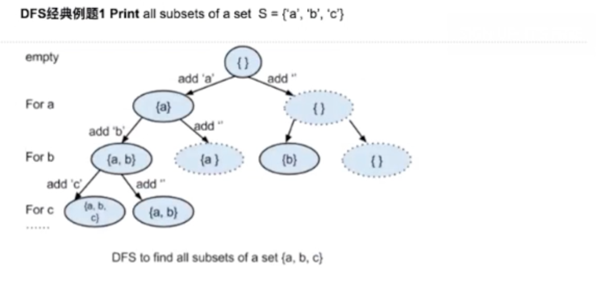
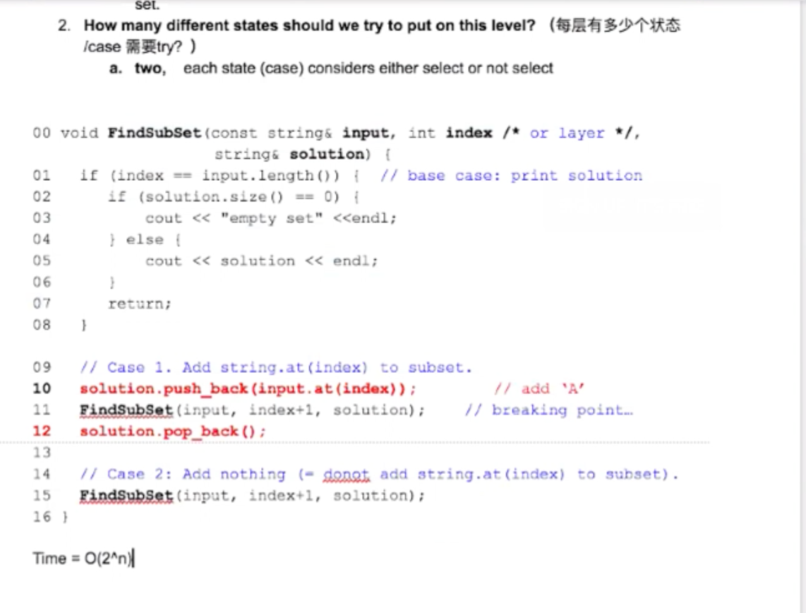
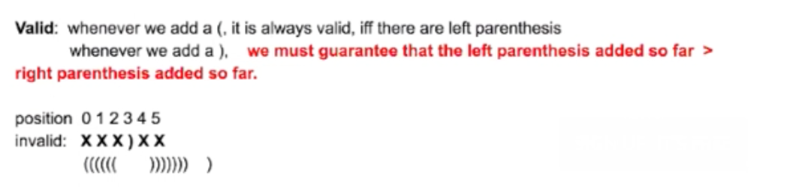
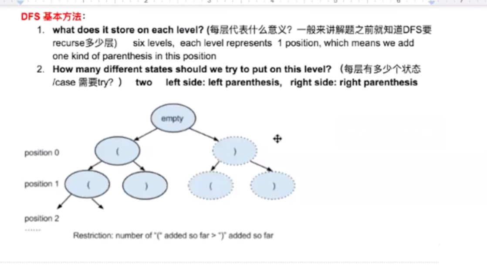
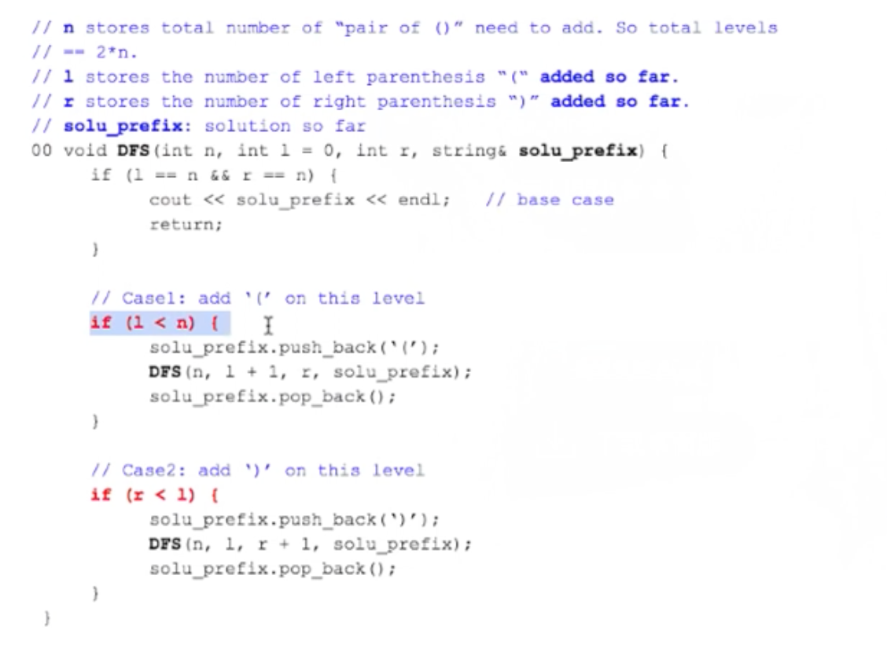
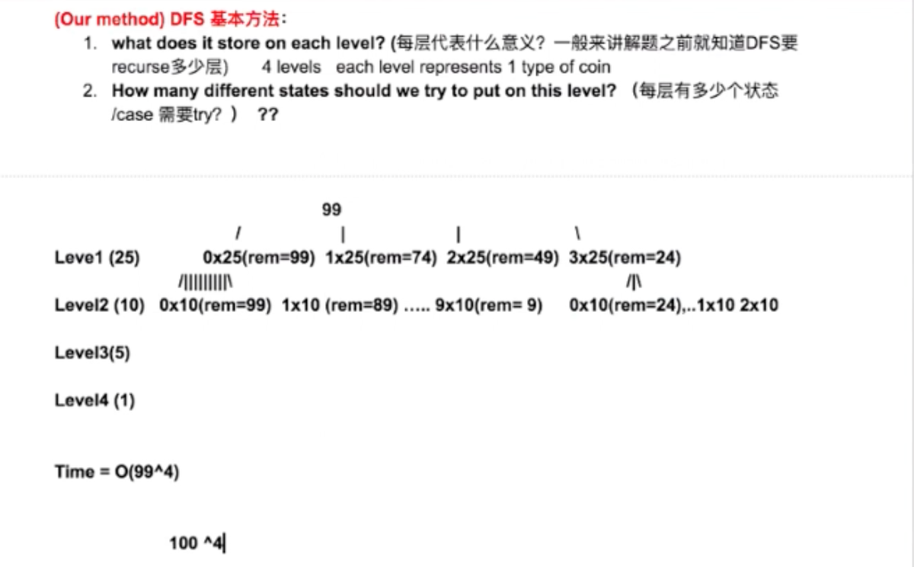
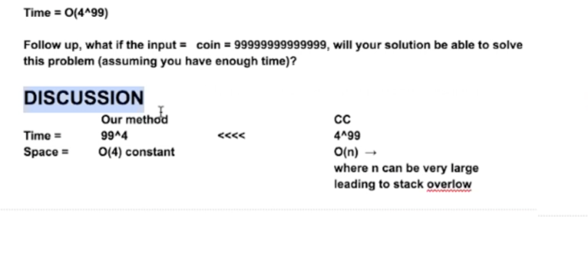

Recursion

constru

High Level:

DFS, in more general scope, it is one kind of search algorithm.

DFS can be implemented in either recursive way or in iterative way.

DFS基本方法：

1. what does it store on each level? (每层代表什么意义？ 一般来讲解题之前就知道DFS要recurse多少层) **(分多少层)**
2. How many different states should we try to put on this level? (每层有多少个状态/ case 需要try) **(每层多少个分叉)**

**DFS经典例题1 Print all subsets of a set S = {‘a’, ‘b’, ‘c’}**

**example** = {}, {a}, {b}, {c}, {ab}, {ac}, {bc}, {abc}

**
**



Notes: 所有permutation问题都是数学问题。

 a b c

Math 0 \* 0 \* 0 —\> empty

 1 0 0 

 1 1 1 

 a 3b c

Math 0 \* 0 \* 0 —\> empty

 1 0 0  

相对独立， 

* 每层只考虑一个元素

1. DFS基本方法：

  1. what does it store on each level? (每层代表什么意义？ 一般来讲解题之前就知道DFS要recurse多少层)
    1. for
  2. How many different states should we try to put on this level? (每层有多少个状态/ case 需要try)
    1. two, each state(case) considers either select or not select

  > index 0, 1, 2

  > string input = a b c

  

```java
void FindSubSet(co)
```

DFS 经典例题2 fina all valid permutation using the parenthesis provided.







* 凡是permutation的 都是exponential

DFS 经典例题3 Print all combination of coins that can sum up to a toal value k. 

E.g. total value k = 99 cents

coin value = 25, 10, 5, 1 cents

Variant: 65 points of basketball score 6 3 2 1





```java


// need a 在第一层确定第一个元素，第二层确定第二个元素

public void permutation(char[] input, char[] nextLevel, char[] rem, int level) {
  
}


```

Conclusion: 

* whenever every single permutation contains all elements in the initial input, then you should consider SWAP and SWAP

1. subset 加a/不加a
2. permutation of parenthesis
3. 99 cents
4. permutation of abc

Discussion：

1. BFS1 vs BFS2
2. BFS1 vs DFS when to use one or the other?
  1. Both BFS and DFS can solve permutation problems (Not true)
    1. Because the space issue: BFS1 can have a very long/large queue.size since the recursion three can grow exponentially.